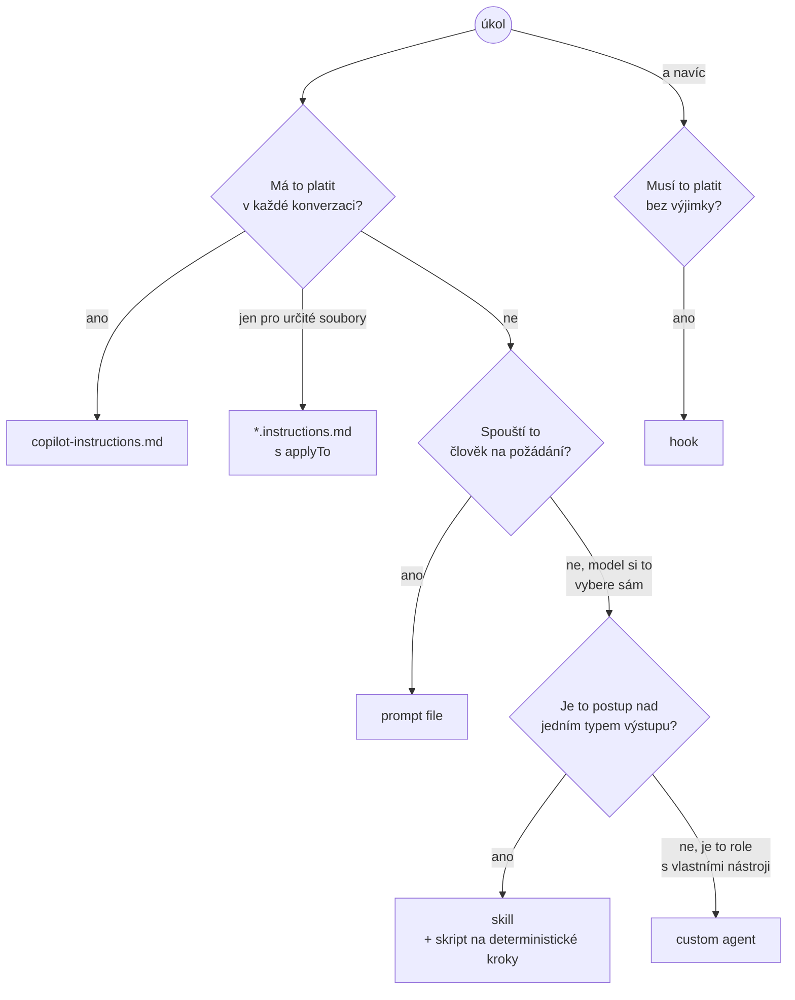
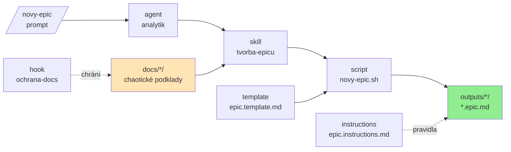

# ⭐️ GitHub Copilot workshop — demo repo

Ukázka, jak si postavit vlastní „AI framework" nad GitHub Copilotem. Celé demo řeší
**jeden use case: vytvoření epicu z chaotických podkladů**.

Podklady v `docs/` popisují dva fiktivní bankovní projekty. Pocházejí od různých lidí
(PM, business owner, architekt, legal, UX) a **úmyslně si odporují** — cvičení je o tom
rozpory najít a zapsat, ne o tom je rozhodnout.

| Projekt           | Podklady                  | K čemu je                                  |
| ----------------- | ------------------------- | ------------------------------------------ |
| Smart Savings     | `docs/smart-savings/`     | hotová ukázka v branchi `ukazka`           |
| Finanční ukazatel | `docs/financni-ukazatel/` | cvičení — postav si framework sám na `main` |

## 🌿 Branche

- **`main`** — AI artefakty jsou záměrně **prázdné kostry s TODO**. Hotový je jen skript `novy-epic.sh`
  a hook `ochrana-docs`, který chrání `docs/` před zápisem. Tady začínáš.
- **[`ukazka`](https://github.com/DXHeroes/github-copilot-workshop/tree/ukazka)** — kompletní
  řešení nad Smart Savings, vrstvu po vrstvě. Každá vrstva má vlastní tag (`02-instructions`
  … `07-skladani`), takže si můžeš stáhnout přesně ten stav, který tě zajímá.

## 🧱 AI artefakty v tomto repu

| Artefakt        | Soubor                                        | K čemu je                          |
| --------------- | --------------------------------------------- | ---------------------------------- |
| agent instrukce | `.github/copilot-instructions.md`             | vždy platný kontext projektu       |
| instructions    | `.github/instructions/epic.instructions.md`   | pravidla pro soubory `*.epic.md`   |
| prompt          | `.github/prompts/novy-epic.prompt.md`         | vstupní bod `/novy-epic`            |
| agent           | `.github/agents/analytik.agent.md`            | role a operating flow              |
| skill           | `.github/skills/tvorba-epicu/`                | postup nad jedním typem artefaktu  |
| script          | `.../tvorba-epicu/scripts/novy-epic.sh`       | deterministický krok místo modelu  |
| template        | `.../tvorba-epicu/assets/epic.template.md`    | struktura výstupu                  |
| hook            | `.github/hooks/ochrana-docs.json` (+ `.py`)   | kontrola, která platí vždycky      |

## 🧭 Kterou vrstvu použít

| Vrstva       | Náklad                              | Přínos                                          |
| ------------ | ----------------------------------- | ----------------------------------------------- |
| instructions | pár řádků, ale žerou kontext vždycky | konvence, které nemusíš opakovat v promptu       |
| prompt       | jeden soubor                        | ověřený prompt používá celý tým                 |
| skill        | `SKILL.md` + skripty a šablony      | opakovatelný postup, bez MCP serveru            |
| agent        | role, hranice, výběr nástrojů       | delegace s jasným místem, kde rozhoduje člověk  |
| hook         | skript a jeho údržba                | kontrola, která nezávisí na tom, co model udělá |

## 🗂️ Struktura repa

- `docs/<projekt>/` — chaotické podklady k projektu a `dod-sablona.md` (zdroj pravdy)
- `outputs/<projekt>/` — vygenerované výstupy
- `.github/` — vlastní AI framework nad Copilotem

## ▶️ Jak s tím pracovat

1. Otevři jeden artefakt a nahraď TODO vlastním obsahem.
2. Zkus ho v chatu (např. `/novy-epic`) nad `docs/financni-ukazatel/` a podívej se, co se změnilo.
3. Přidej další artefakt tam, kde ti něco chybí.
4. Když nevíš, jak dál, podívej se, jak stejnou vrstvu řeší branch `ukazka`.

## 🔍 Na co se u toho dívat

- Co patří do **instructions** a co už do **skillu**?
- Proč zakládá soubor **skript** a ne model?
- Co by se stalo, kdyby **template** neexistoval?
- Proč má **agent** delegovat na skill místo vlastního postupu?
- Proč kontrolu zápisu do `docs/` řeší **hook**, a ne věta v instrukcích?

