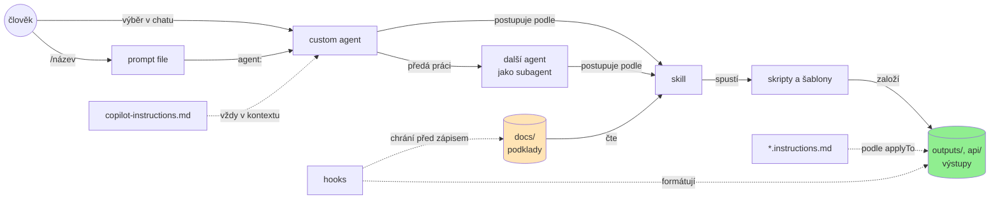
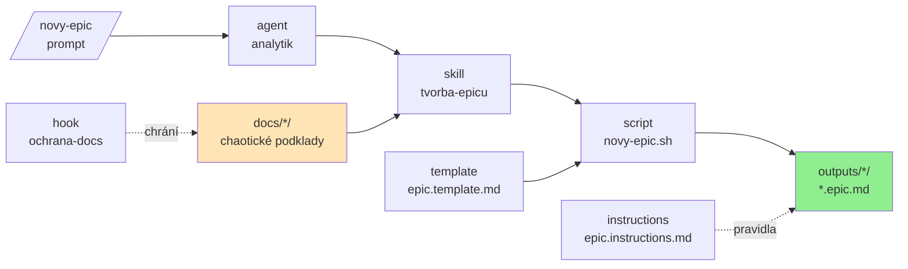

# ⭐️ GitHub Copilot workshop — demo repo

Ukázka, jak si postavit vlastní „AI framework" nad GitHub Copilotem. Celé demo řeší
**jeden use case: vytvoření epicu z chaotických podkladů**.

Podklady v `docs/` popisují dva fiktivní bankovní projekty. Pocházejí od různých lidí
(PM, business owner, architekt, legal, UX) a **úmyslně si odporují** — cvičení je o tom
rozpory najít a zapsat, ne o tom je rozhodnout.

| Projekt           | Podklady                  | K čemu je                                   |
| ----------------- | ------------------------- | ------------------------------------------- |
| Smart Savings     | `docs/smart-savings/`     | hotová ukázka v branchi `ukazka`            |
| Finanční ukazatel | `docs/financni-ukazatel/` | cvičení — postav si framework sám na `main` |

## 🌿 Branche

- **`main`** — AI artefakty jsou záměrně **prázdné kostry s TODO**. Hotový je jen skript `novy-epic.sh`
  a hook `ochrana-docs`, který chrání `docs/` před zápisem. Tady začínáš.
- **[`ukazka`](https://github.com/DXHeroes/github-copilot-workshop/tree/ukazka)** — kompletní
  řešení nad Smart Savings. Když tě zajímá jedna vrstva, otevři rovnou její složku
  v `.github/` podle tabulky níže.

## 🧱 AI artefakty v tomto repu

| Artefakt           | Kde                                      | Proč                                                                         |
| ------------------ | ---------------------------------------- | ---------------------------------------------------------------------------- |
| instrukce projektu | `.github/copilot-instructions.md`        | kontext, který platí v každé konverzaci                                      |
| instruction files  | `.github/instructions/*.instructions.md` | pravidla jen pro určité soubory (`applyTo`), jinde nezabírají kontext        |
| prompt files       | `.github/prompts/*.prompt.md`            | vstupní bod workflow, spouští ho člověk přes `/název`                        |
| custom agenti      | `.github/agents/*.agent.md`              | role s vlastními nástroji a hranicemi, subagent šetří kontext hlavního chatu |
| skills             | `.github/skills/<název>/`                | opakovatelný postup nad jedním typem výstupu                                 |
| skripty a šablony  | složky `scripts/` a `assets/` ve skillu  | deterministické kroky, které nedělá model                                    |
| hooks              | `.github/hooks/*.json`                   | kontrola, která platí vždycky, ať model udělá cokoli                         |

Jak na sebe artefakty navazují:

## 🗂️ Struktura repa

- `docs/<projekt>/` — chaotické podklady k projektu a `dod-sablona.md` (zdroj pravdy)
- `outputs/<projekt>/` — vygenerované výstupy
- `.github/` — vlastní AI framework nad Copilotem

## ▶️ Jak s tím pracovat

1. Otevři jeden artefakt a nahraď TODO vlastním obsahem.
2. Zkus ho v chatu (např. `/novy-epic`) nad `docs/financni-ukazatel/` a podívej se, co se změnilo.
3. Přidej další artefakt tam, kde ti něco chybí.
4. Když nevíš, jak dál, podívej se, jak stejnou vrstvu řeší branch `ukazka`.

## 🔍 Na co se u toho dívat

- Co patří do **instructions** a co už do **skillu**?
- Proč zakládá soubor **skript** a ne model?
- Co by se stalo, kdyby **template** neexistoval?
- Proč má **agent** delegovat na skill místo vlastního postupu?
- Proč kontrolu zápisu do `docs/` řeší **hook**, a ne věta v instrukcích?

